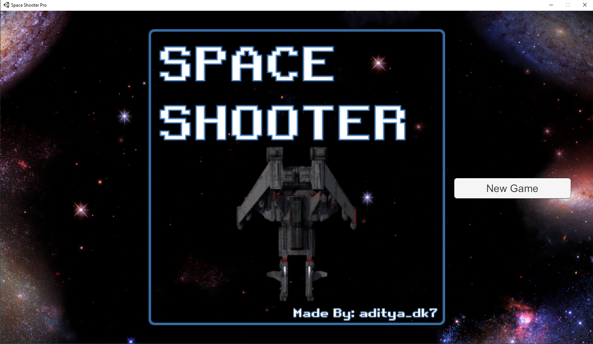
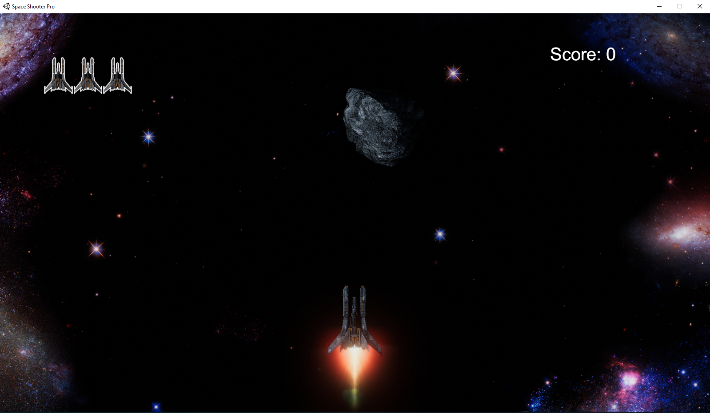
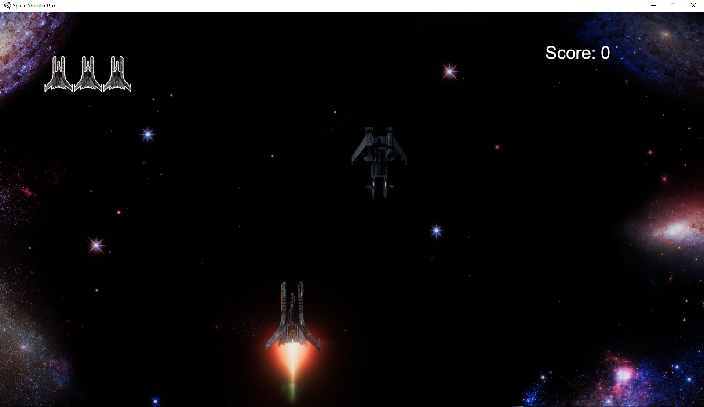
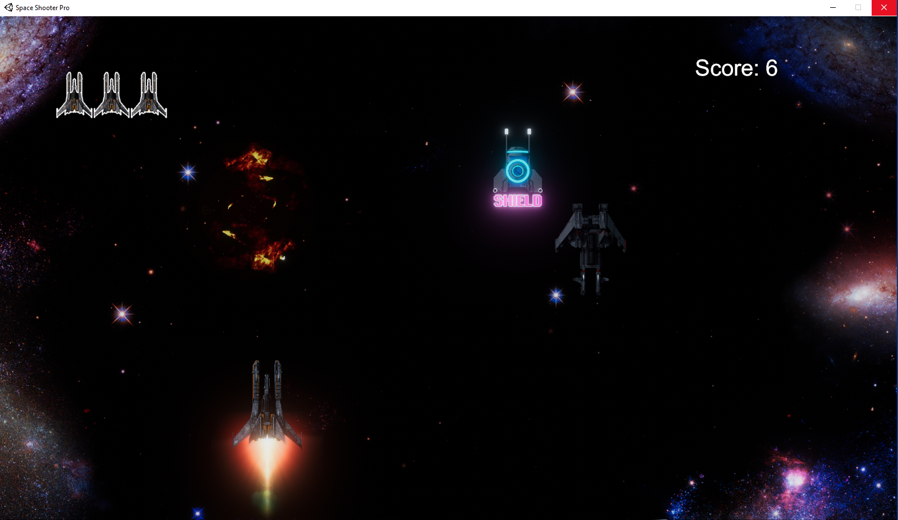
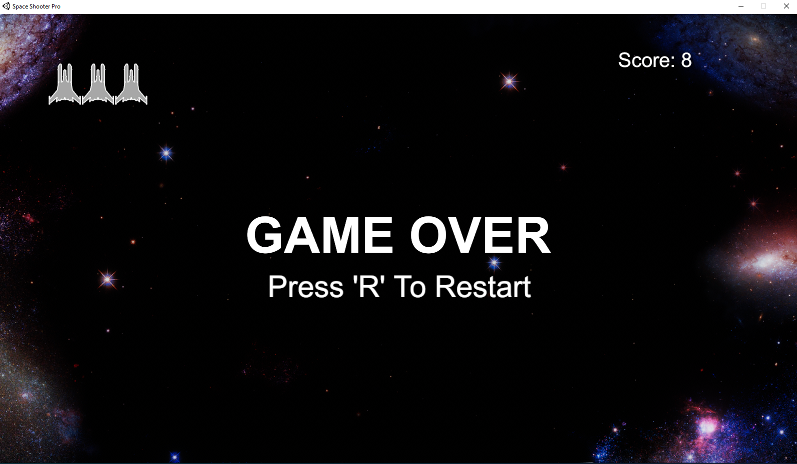

# Space Shooter Pro
Space Shooter Pro is my first attempt in the world of Game Development. This is a retro style game that allows you to control a warship to kill the enemies. After a lot of Lasers and C#, I have reached here. 
To download: https://github.com/aditya-dk7/Space-Shooter-Pro/raw/master/Space%20Shooter%20Pro.zip  
Following are the Screens:  
  
  
  
  
  
# Note
I am not a designer & have not created any designs or effects for this game. I have just written the code
